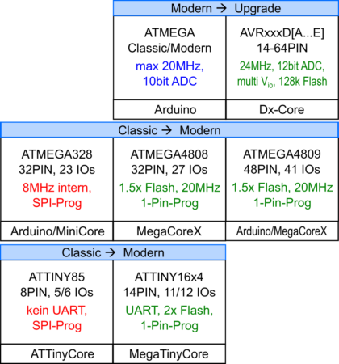
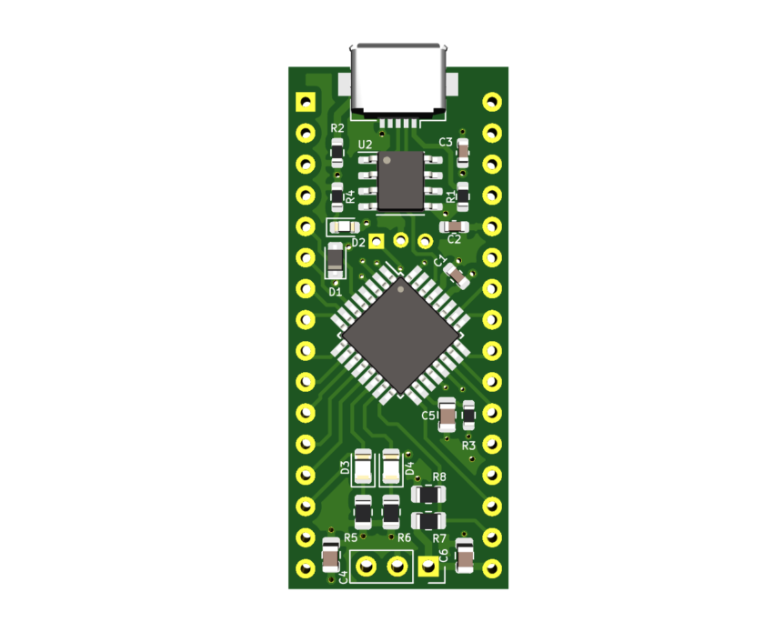

# Arduino-Nano-Clone-4.0
## Arduino Nano Klon 4.0 auf Basis eines ATMega4808

### Wo geht der Weg hin (wenn wir wieder weiter gehen können)?

Es gibt für mich als "Bastler" drei große Bereiche, für die ich Microcontroller einsetze:
1. "Mal eben"-Projekte, die etwas einlesen, ausgeben oder steuern sollen. Meist mit **Arduino-Nano oder Mini** -- wenn es kleiner werden soll, auch direkt ein **ATTiny** auf einem Breakout-Board.
2. Komplexere Steuerungen mit etwas mehr Rechenpower und Computer-Anbindung (USB): **RP2040**
3. Netzwerk (WLAN) Anwendungen die etwas im Internet machen sollen: **ESP32**

Bei 2. und 3. macht eine Eigenentwicklung keinen Sinn, weil es genug Development-Boards auf dem Markt gibt. Doch gerade die beliebten Arduino-Boards der 1. Generation sind im Moment entweder schwer zu bekommen, oder extrem teuer (Klone liegen bei 8-22EUR):

Außerdem war ich nie ein Freund von Quarzen. Ich liebe interne Oszillatoren. Natürlich sind sie nicht sehr genau ... doch viele Boards verwenden billge Resonatoren statt Quarze - die sind auch nicht viel genauer.

Vorlage sind für mich hier zunächst das **ATMEGA4808 megaAVR Mini Dev. Board, Arduino Compatible**

(https://www.electrodragon.com/product/atmega4808-megaavr-mini-dev-board-arduino-compatible/)

Das dürfte die "Kaufvariante" der nächsten Generation sein. Bereits auf den MegaCoreX ausgelegt bzw. kompatibel, günstig und kompakt.
Ein <ins>Hinweis:</ins> Ab Werk ist die Platine auf 3.3V eingestellt, läuft aber problemlos mit 16MHz. Wer mit ext. Komponenten aber auf 5V kommunizieren möchte,
muß die beiden Jumper "invertieren". D.h. die Lötbrücke bei `CON=3V3` entfernen und die Lötbrücke von 3V3 auf 5V ändern.

### Und da ist das **ATmega4808 Development Board** von [#wagiminator] Stefan Wagner 

(https://github.com/wagiminator/AVR-Development-Boards/tree/master/ATmega4808_DevBoard)

Welches mir als Inspiration für mein Board diente.

Da ich keinen Bedarf für einen 32kHz Quarz habe, habe ich diesen weggelassen. Da ich eigentlich keinen Upload per Bootloader vorhabe, sondern direkt per UPDI, habe ich ebenfalls den CH340N verwendet, der zwar ein RTS-Signal besitzt, aber kein DTR. Das hat mir unter Linux bisher immer Probleme gemacht, wenn es um den Upload per Bootloader ging. Aber die serielle Kommunikation funktioniert einwandfrei.

Die Spannungsversorgung ist über USB vorgesehen (5V), doch auch eine alternative Spannungsversorgung ist mit einem dreipoligen Spannungsregler machbar. Dabei habe ich mich bewußt gegen einen Spannungsregler auf dem Board entschieden, da Linear-Regler Gift für einen Akku-Betrieb sind, und sobald man die Platine irgendwo einbauen möchte, braucht man ja ggf. eine unabhängige Stromversorgung.

Stefan's Idee, auch einen **AVRxxDy32** alternativ zu verwenden, gefällt mir ebenfalls. Insbesondere für einen 12bit ADC oder Port C mit eigener (z.B. 3.3V) Spannungsversorgung...

**Update:** Auch wenn ich immer noch der Meinung bin, der ATMEGA4808 ist der geeignetste Nachfolger für den ATMEGA328, ist für mich die Priorität deutlich gesunken, da es ja schon ein gutes und günstiges ATMEGA4808-Board im Nano-Style gibt.
Daher wende ich mich der Variante AVR64DD28 zu, quasi als Nachfolger zum ATTINY88 und leistungsfähiger als alles bisher angefasste. Sollte das löten allerdings zu viele Probleme machen, werde ich wohl auf den AVR64DD32 "upgraden" :-) 
